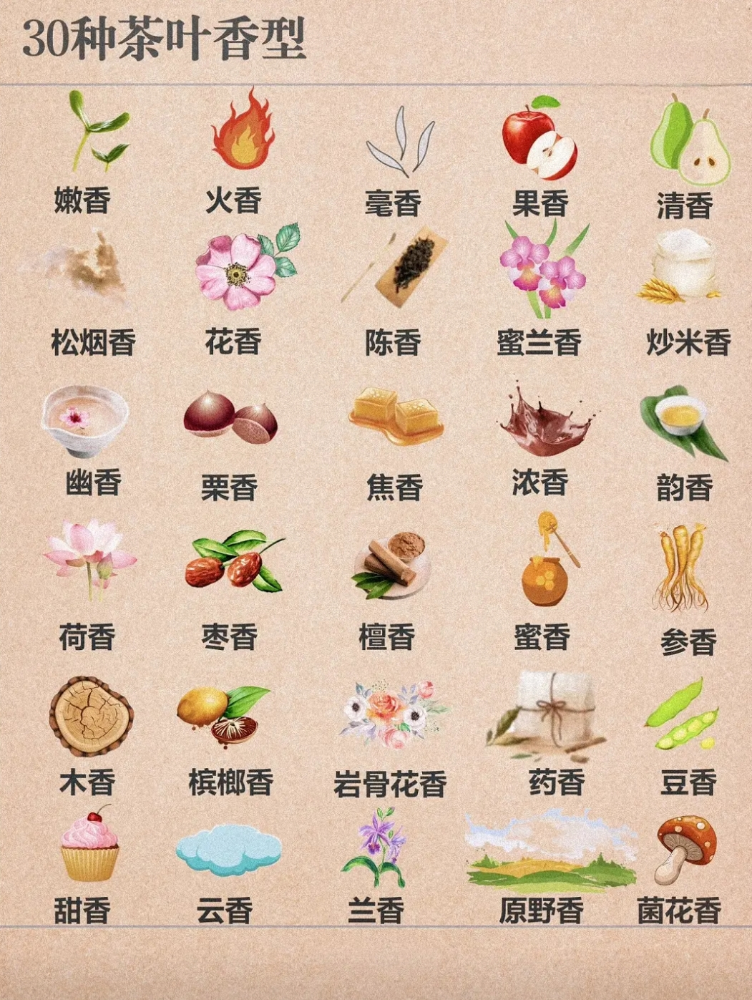
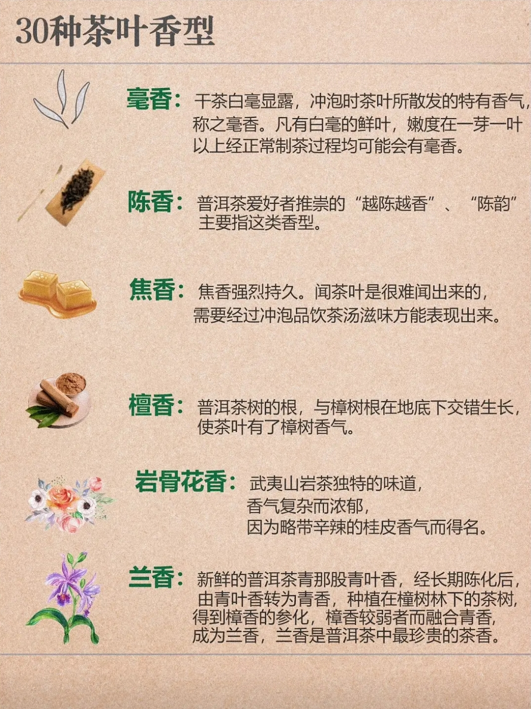
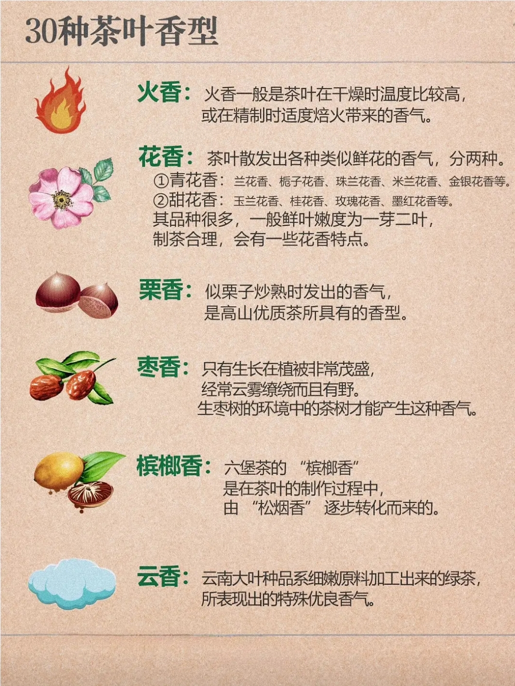
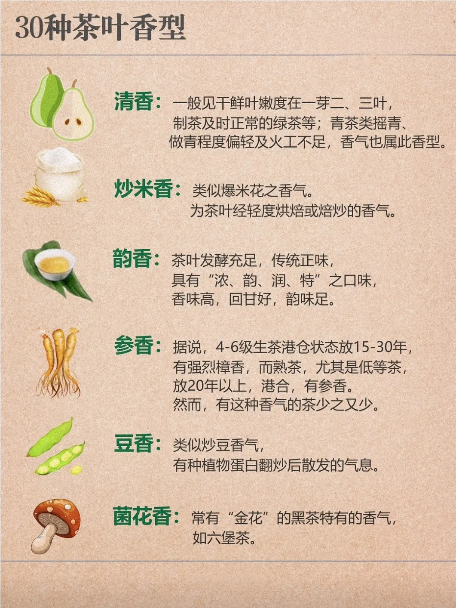
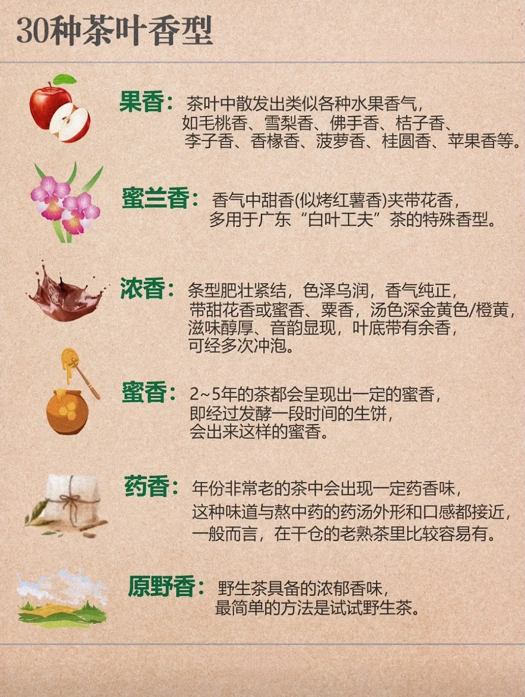
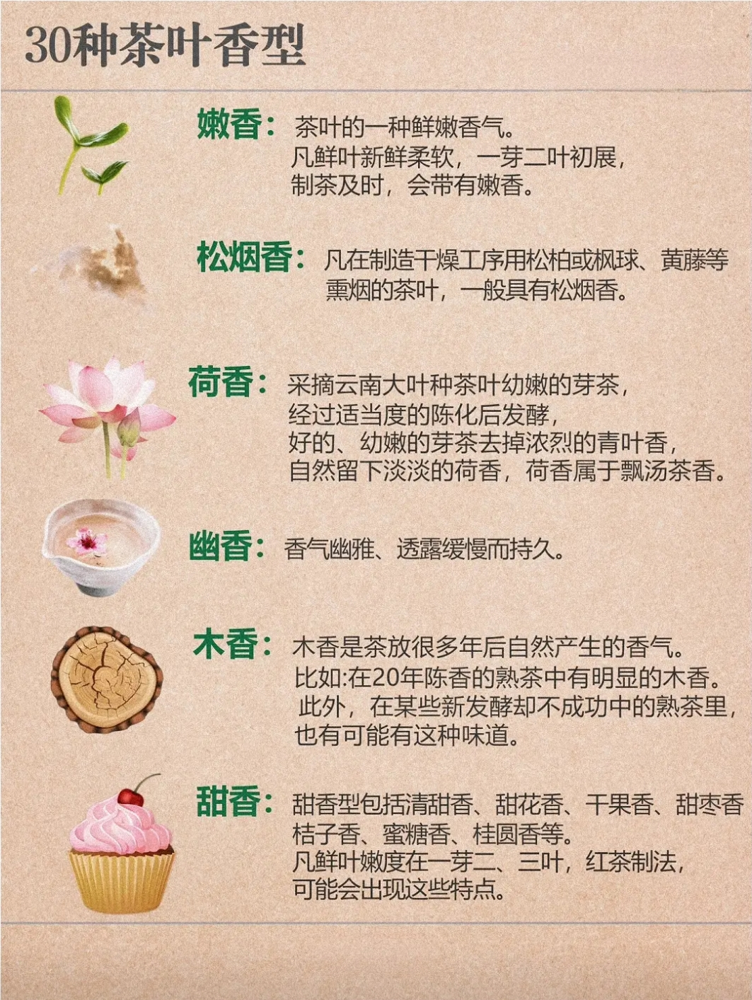

# 《茶经》——陆羽
《茶经》是唐代陆羽所著，是中国乃至世界上现存最早、最完整、最全面的茶学专著，被誉为“茶叶百科全书”。陆羽在书中详细介绍了茶叶的种植、采摘、制作、品质、功效、饮用方法、茶具、茶道等方面，对后世茶学的发展产生了深远的影响。
后世称陆羽为“茶圣”，是唐代著名的茶学家、诗人、哲学家。他出生于唐朝安西（今新疆）凉州，自幼酷爱文学，后因不满官场腐败，遂弃官从文，成为一位著名的茶学家。陆羽一生著述颇丰，其中最为人所熟知的是他的《茶经》。
- [《茶经》](/茶/茶经.md)

# 普洱茶
个人由于相对更熟悉普洱茶，所以对普洱茶有更多的了解，所以这里单独拎出来介绍普洱茶。

# 其他茶
## 白茶

## 绿茶

## 红茶

## 乌龙茶

## 黄茶

## 黑茶

# 基本概念

## 台地茶

台地茶，简单理解就是喷洒农药的茶叶，这往往成本低，售价低，往往用于奶茶之类的，批量添加/售卖。

如何辨别台地茶？泡过后导出来，手感一捏即碎，呈泥状，没有劲道。正常的普洱茶导出来，握住两端旋转拧茶叶，依旧是条索分明的。抖音应该蛮多卖台地的吧...

## 生茶
生茶是未经发酵的茶叶，其特点是茶汤颜色清澈，香气清新，口感鲜爽。生茶未经发酵，保留了茶叶的天然物质，口感更加清新，适合喜欢清淡口感的茶客。
## 熟茶
熟茶是经过发酵的茶叶，其特点是茶汤颜色红亮，香气浓郁，口感醇厚。熟茶经过发酵后，茶叶中的多酚类物质发生了变化，使得茶汤的颜色、香气和口感都发生了变化。熟茶通常用于泡茶，口感更加醇厚，适合喜欢浓郁茶香的茶客。
个人更建议初学者从生茶开始，因为生茶口感更加清新，容易上手。

## 拼配

### 什么是拼配

普洱茶的拼配是指将不同产地、不同年份、不同等级的茶叶混合在一起，通过科学合理的搭配，使得茶叶在口感、香气、色泽等方面达到最佳效果。

### 拼配的意义

拼配不仅可以平衡茶叶的质量差异，还可以创造独特的拼配比，满足不同人群的口感需求。

### 如何判断拼配茶

好的拼配茶不仅需要看配料表，更重要的是品鉴其香气、滋味以及茶汤的颜色。

### 拼配和纯料的区别

拼配，往往是为了取得与纯料不一样，追求综合效果——（对于个人而言）更完美的口感。可买拼配茶，也可以买纯料自行拼配

简单来说，拼配追的是一个六边形战士，而纯料可能是天生的四边形、五边形战士。

### 自行拼配的原则、方式

拼配犹如主客，有主次之分。需以一款茶为主，另一个风味的茶为辅助。

拼配方式多种多样，常见的有不同茶区搭配、不同年份搭配（比如3年新茶跟15年老茶拼）、不同山头搭配、不同树搭配（大树、古树等）、不同时间段的拼配（与不同年份不同，这个指的是临时拼配或压饼之前就拼了）。

拼配的各种茶的比例可以是631、721等，按自己意愿搭配出自己认为最适合的口感即可。

## 茶具
现在最常用的用于泡茶的器具有盖碗、紫砂壶，与之相关的还有各种茶杯、茶盘、茶几、茶宠等。各有喜好，因人而异。切记要真的紫砂壶。

## 常用品评词汇
茶友们一起喝茶时，常常会问：“这茶怎么样？”

有的茶友，只会说好喝或不好喝，说不清是哪里好，也说不出怎么不好。

而有的茶友，能把茶的色、香、味一一分析，说得头头是道，让人不得不佩服。

### 茶汤

#### 如何简单辨别年份？

根据茶汤颜色辨别，浅黄——黄——橙色——红色，逐年份往上越黄，但是这种方法不能100%适用，只是大体的。比如说红茶直接出来就是橙色红色了，因茶而异，辨别年份还需根据口感、香味辨别属于哪一种茶，大概属于第几泡，了解清楚情况了再下定论。

### 茶香

香气字如其名，具体各自品评感受，闻着茶香真的是一种享受。

**花香**、**蜜香**、**果香**、**鲜爽**、**清香**（青气）、**陈香**

**板栗香**、**毫香**、**桂圆干香**、**焦糖香**、**松烟香**、**奶香**、**甜香**

不喝茶感受不到，那就上图（注明：此处图片来源抖音茶香飘飘UP主，链接：6.43 05/06 PkC:/ Q@X.Mw 30种茶叶香型，能辨别一半算你厉害# 茶知识 # 茶生活 # 今天你喝茶了吗 # 茶文化 # 茶香四溢  https://v.douyin.com/iSbgMJ11/ 复制此链接，打开Dou音搜索，直接观看视频！）。

### 茶香五层次

看网上还说了什么茶香的五个层次：水飘香、香入水、水含香、水生香、水即香。

乍一看，觉得不是那么回事，细思索确实有它的道理。对此，前三种都喝过了，第四种印象比较浅，之前没特别留意，不知道算不算是水生香（刚写完水生香，确实是这样的），水即香没喝过，不知道该是怎么样的了。

既然如此，便做个记载：

**水飘香**:茶香肤浅飘扬，可闻而喝不得

**香入水**：茶香弥漫，闻得见，喝得着，只是喝的香没有闻的多

**水含香**：茶香弥漫口腔，魅力凸显，回味无穷。最简单的理解就是杯底留香，挂杯香。

**水生香**：闻着不怎么香，但喝下去茶香在喉咙深处缓慢溢出。泡了一泡以后，打开盖碗或紫砂壶就能闻到

**水即香**：汤香合一

### 茶汤

**褒义**

**回 甘**

喝茶后，口腔内有甘甜的感觉。一般来说，回甘多与苦味相联系，指苦味在口中转化消失过程中产生的甜，但许多入口无苦味的好茶，也会有回甘。

**生 津**

生津，是喝茶时茶汤中的多酚类等物质，刺激口腔内壁，使其紧束收敛，使到两颊、舌面、舌底，不断分泌唾液。

**层次感**

层指重叠之象，次指先后顺序。指茶汤香气和滋味在口腔中转变的感觉。

**喉 韵**

指的是汤叶涌上舌苔，流至喉咙时，带给喉咙的感觉。例如甘甜、滋润、锁喉等表现。

**饱 满**

茶叶的饱满度是指茶汤中物质丰富，带给口腔的一种充实感，主要表现是茶汤进入口腔后，能感受到茶叶内含物质丰富，析出丰厚的滋味，并且多种不同的味道和谐配合在一起。

**果酸味**

品茶汤时带有鲜味，像新鲜的酸果味。

**陈韵**

经时间陈化而产生的韵味，常在有一定年份的旧茶中易感到。

**香气内敛**

香气不张扬，其香在水，用心则有，不用心则无。

**入口即化**

茶汤入口，不用有意识的吞咽，自然入喉。特别是陈年好茶，人们说“入口即化，喝了没喝”，是品普洱茶时人们对茶汤水性最高境界的赞叹语。

**爽朗**

经岁月的陈化仓储优良的茶汤入喉后，口腔爽朗，牙齿有清晰感。

**茶 气**

茶气是由茶叶中有机锗与多糖类结合而溶于水产生的，往往表现为打嗝、身体发暖、发热、发轻汗。

**舌底鸣泉**

是指喝完茶后，舌头底下能清晰感受到不断有津液大量生成的过程。生成的津液，能使口腔持续保持润滑，带来舒适的感觉。

通常品质很好的茶都会带来舌底鸣泉的感受。

**中性**

**茶性**

专指茶汤入口后口感的刺激性。包括香型和苦涩度，常用“强、弱”来形容。

**茶 质**

就是茶汤入口后，汤质在口内的丰满程度。包含滑度，甜度，回甘度，含水量和耐泡泡性，常用“厚”，“厚”来形容。

**香 气**

香气是鲜叶在制作工艺中产生出来的气味，例如蜜香、花香、菌香，可表现为香气高扬、香气下沉等。

**苦、涩**

茶叶的苦多由茶叶内含物质中的茶碱产生，涩感则主要由脂型儿茶素所导致。苦涩是茶汤给我们味觉非常直观的表现。（注意苦和涩不是一回事，同时苦、涩不是不好的，当茶化开的快同样能带来不一样的感受）

**化 开**

多数指茶汤中的苦味、涩味在口腔中短暂停留后消失不见。通常来说，苦味和涩味能在口腔中化开的茶，才算是好茶。

**收敛性**

品茶后，舌面和口腔四周出现的紧绷感，类似吃完柿子后的感觉，多为涩感的表现。

**水味**

茶汤滋味很淡薄，喝茶已经喝到水的甘甜味而非茶本身的甘甜，叫做水味。基本上水味出现在喝茶最后的阶段是正常的。

**水性**

指茶汤带给口腔的每种不同的感觉，如滑、化、活、砂、厚、薄、利七方面，多用来判断普洱茶的品质品质。其中滑、化、活、砂、厚是普洱茶正面特色，而薄和利则是负面性特征，其是能影响品茗情境的。多在品普洱茶时使用。

**挂 杯**

指的是茶汤流经茶杯内壁时，附着在其中的缕缕香气停留在杯壁的时间，出现挂杯香的茶往往是好茶。

**水 味**

指喝茶时，明显感到茶味和水的分离、不融合，尤其在咽下之后，口腔中没有茶味的感觉，就像喝水一样。常见于第一泡，具体饮茶、茶的状态、茶具而异。

**贬义**

**酸味**

在揉捻后未晒干，压制时所含水分过高而产生。

**青 味**

青味一般鲜叶在杀青过程中，温度不够或时间不足而产生的，严重时会有“青腥味”。

**锁 喉**

指茶汤咽下后带来的喉部的不舒适感，或干涩、或麻痒、或肿胀、或有异物感等，也称为挂喉、叮喉咙。

**茶水分离**

茶汤入喉，嘴里留的不是茶味，而是水气。

**特殊**

**烟熏味**

茶叶加工工艺过程中产生的烟熏气味。并非指不好的气味，判断好坏由茶而异。大部分情况下茶不应该有烟熏味。少部分如武夷正山小种，湖南沩山毛尖等特殊品种在加工中会有烟熏的工艺，形成相应的品质。
